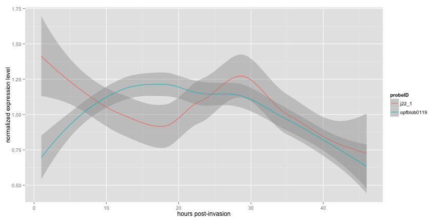

## Malariapp

Malaria is caused by the parastitic protozoan Plasmodium falciparum and infects more than 300 million people and kills upwards of 1 million people each year. Most of these deaths occur in children under 5 years old.


Studying the genomics of the parasite can lead to the identification of novel drug targets for the development of future therepeutic interventions.

In 2003, [Bozdech et al.](http://www.plosbiology.org/article/info%3Adoi%2F10.1371%2Fjournal.pbio.0000005) published a high resolution microarray analysis of all 6000 of the parasite's genes at every hour of its 48h life cycle within human red blood cells.

The Malariapp allows the user to visualize the expression profile of any two of the parasite's genes. This simplifies the complex data set, allowing users to easily compare and contrast expression profiles to facilitate hypothesis generation. 

---

## Data Munging


The original dataset provided by [Bozdech et al. 2003](http://www.plosbiology.org/article/info%3Adoi%2F10.1371%2Fjournal.pbio.0000005) consisted of a dataframe of ~6600 rows (parasite genes) and ~50 columns (gene names, gene description, and 48 one-hour interval time points. The entries of each cell of the dataframe contained the normalized gene-expression values derived from the microarray processing. Here, the data was cleaned and tidied into a "long" dataframe containing only three columns: gene name, time point, and normalized expression value. 316 296 corresponds to ~6600 genes by 48 time points.


```r
dataset
```

```
## Source: local data frame [316,296 x 4]
## 
##     X    probeID timepoint value
## 1   1   a10325_1         1    NA
## 2   2  a10325_16         1    NA
## 3   3  a10325_20         1 1.106
## 4   4  a10325_26         1 0.827
## 5   5  a10325_29         1 2.676
## 6   6  a10325_30         1 2.896
## 7   7 a10325_30h         1    NA
## 8   8 a10325_30i         1 2.999
## 9   9 a10325_30j         1 2.392
## 10 10  a10325_32         1 2.392
## .. ..        ...       ...   ...
```


---

## The Malariapp plotting function

The Malariapp web-application calls a custom plotting function based on the ggplot2 R-package.


```r
make_plot <- function(probe1, probe2, confint){
    df_1 <- dataset[dataset$probeID == probe1, ] %<>% data.frame
    df_2 <- dataset[dataset$probeID == probe2, ] %<>% data.frame
    subdata <- rbind(df_1, df_2)
    ggplot(subdata, aes(x = timepoint,  y = value, colour = probeID)) + 
        geom_smooth(method = "loess", level = confint) + 
        ylab("normalized expression level") + 
        xlab("hours post-invasion")   
}
```

The user selects any two of the ~6600 possible parasite genes using the selection widgets. These selections are used to retrieve the corresponding 48 data rows for each gene from the dataset. The data for both genes are combined into a new dataframe which is fed into a ggplot2 plotting function which calculates a loess smoothed curve of the expression profile of each gene across the 48h parasite lifecycle. The user may also use the input slider to specify a confidence interval for the loess smoother to gain an appreciation in the uncertainty of each gene's profile. 


---

## Sample Plot
For example, selecting the genes "j22_1" and "opfblob0119" with a loess smoothing confidence interval of 95%, calls the following to generate the plot below:

```r
make_plot("j22_1", "opfblob0119", 0.95)
```



